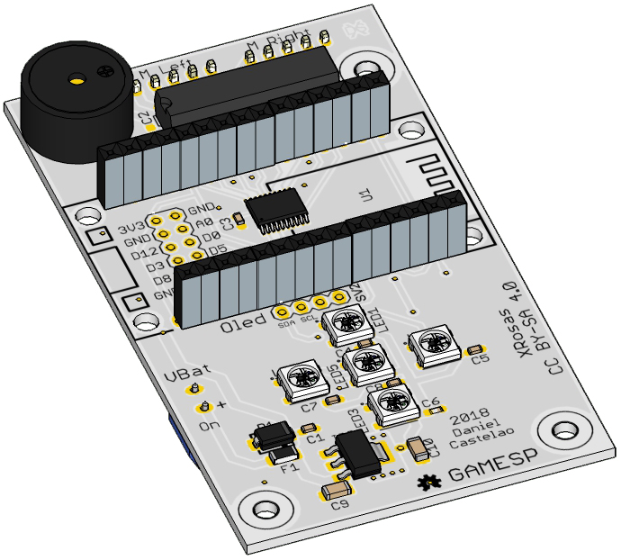
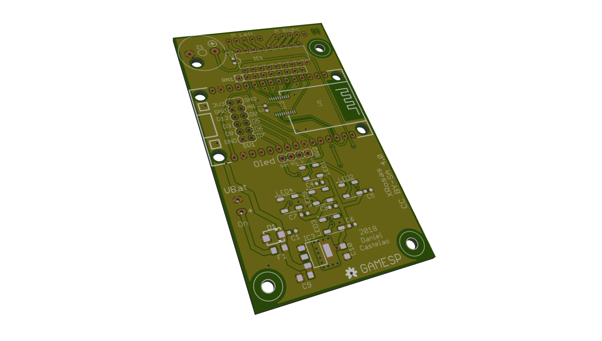
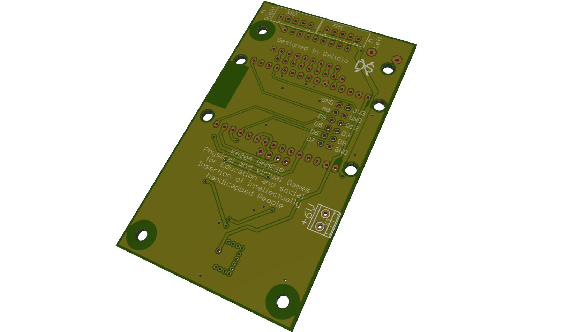

## Pi GAMESP Robot Electronics

## Catalog

- Esquematic and PCB (by [Xdesig][XDE01])

- Gerber 274 machines compatible.

- STL for slicer

- Images mounting Process and connections

- 3d sim (SketchUp, Private use)

## NodeMCU
  ![(devkit-v1.0 [NodeMCU])](official-nodemcu-development-board.jpg)
- NodeMCU License [NodeMCU_LIC]

## License

Every content in this repo, otherwise specified under subdirectories, is
licensed under [Creative Commons BY-SA](LICENSE).

[XDE01]: https://twitter.com/xdesig

[NodeMCU_LIC]: https://github.com/nodemcu/nodemcu-devkit-v1.0/blob/master/LICENSE
[NodeMCU]: https://github.com/nodemcu/nodemcu-devkit-v1.0
